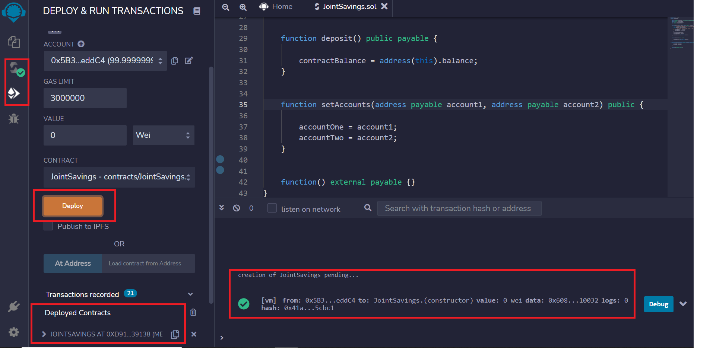
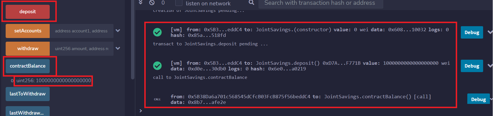
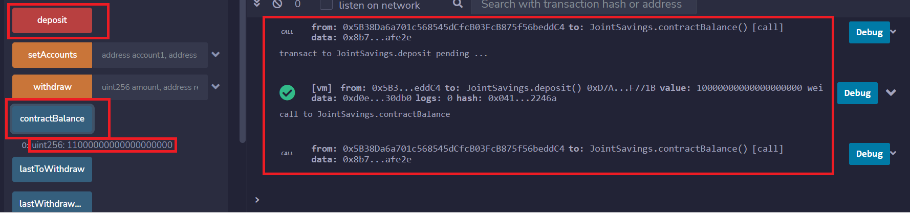
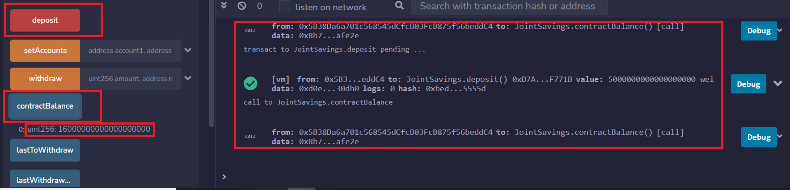
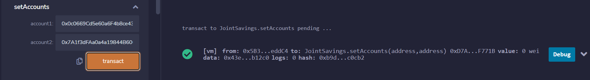
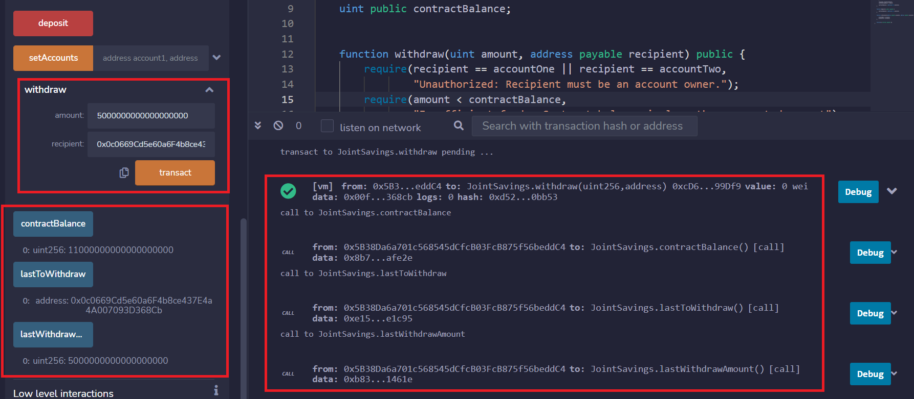
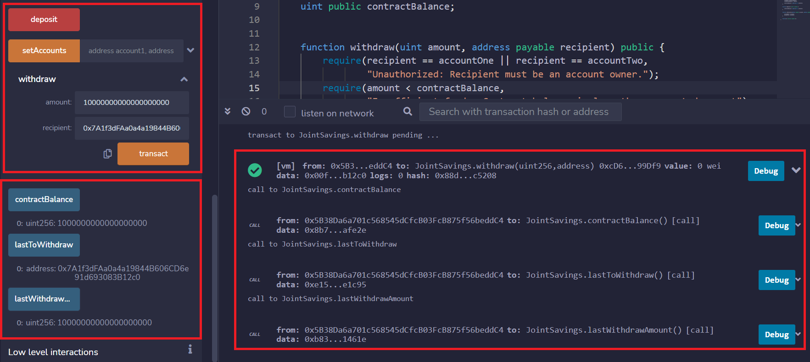
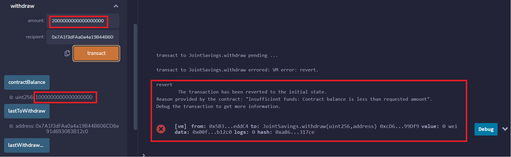
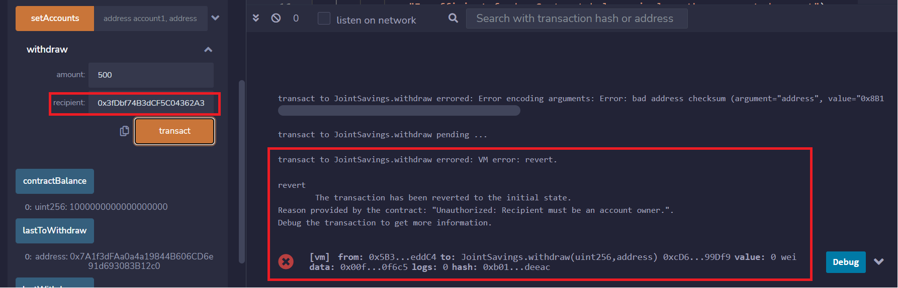

# Joint Savings Account Smart Contract

This repo demonstrates a basic example of enabling functionality for a joint savings account on the Ethereum blockchain through a smart contract.  For demo purposes the smart contract can accept two joint ownership payable addresses that can be withdrawn to  using a method that both validates ownership and contract balance.  Contract balances are set through both a payable deposit method and an external payable fallthrough function.

## Technologies

The application uses the following technologies:

- [Solidity v. 0.5.0](https://docs.soliditylang.org/en/v0.5.0/)
- [Remix IDE](https://remix.ethereum.org/)

## Installation Guide for Demo

### Remix IDE

These instructions assume prior experience with Remix:

- Navigate to [Remix](https://remix.ethereum.org/)
- Load **JointSavings.sol** into the Workspace
- Compile
- Deploy to a JavaScript VM

## Overview

### Objective

The objective of this tool is to demo how a smart contract can govern the rules around a joint savings account.

### Deployment

### Deposits

Deposits to the contract used the Deposit method.

- Initial deposit of 1 ETH as Wei (1_000_000_000_000_000_000):

- Additional deposit of 10 ETH as wei (10_000_000_000_000_000_000)

- Last deposit of 5 ETH

### Configuring Accounts

The joint owner addresses were configuring using the setAccounts method:

### Withdrawals

- Transferring 5 ETH to Account 1

- Transferring 10 ETH to Account 2

- Insufficient funds example

- Unauthorized example

## Contributors

- Jacob Rougeau

## License

MIT
